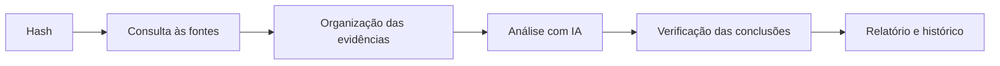

# Challenge Mercado Livre | Threat Intelligence

**CTI Triage** é uma plataforma de triagem de malware. Basta informar o hash de
um arquivo suspeito para que ela:
- consulte o VirusTotal e o MalwareBazaar;
- analise os dados com inteligência artificial;
- indique a provável família do malware;
- gere um relatório de inteligência pronto para as equipes de segurança.

**Hash analisado no case:**
`7a8fc48ce4df4448b91a1e6b66410cca6993ac072cb12860b9cfa6438b25ed8e`

---

## Como funciona



1. **Coleta:** busca o hash no VirusTotal e no MalwareBazaar.
2. **Organização:** cada informação recebida vira uma evidência identificada.
3. **Análise:** uma análise por regras roda sempre; a IA (Claude) complementa com contexto e interpretação.
4. **Verificação:** tudo o que a IA afirma é conferido com as evidências. Conclusões sem base são descartadas, e infraestrutura legítima nunca é apontada como C2.
5. **Entrega:** o resultado fica salvo e disponível no painel, na API e nos relatórios.

A metodologia segue o **ciclo de inteligência**: requisitos, coleta, processamento,
análise e disseminação. Ele se organiza em cinco perguntas-chave (as da tabela
acima), e o nível de confiança de cada conclusão é declarado.

---

## Relatório

Cada análise gera um relatório de inteligência que pode ser visualizado no
navegador ou **baixado em PDF**. O PDF tem:
- **Capa executiva:** veredito, resumo, principais conclusões e ações prioritárias.
- **Parte técnica:** técnicas ATT&CK, infraestrutura, indicadores, orientações de investigação e recomendações D3FEND.
- **Regras de detecção prontas para uso:** geradas para cada análise, cada uma com a hipótese do que um alerta significa.
  - **A partir dos IOCs:** YARA com os hashes da amostra e da cadeia, e consulta de busca para o Elastic Security.
  - **A partir do comportamento observado:** Sigma e EQL, por exemplo para a persistência via LaunchAgent.
- **Marcação TLP** em todas as páginas.
- **Indicadores de rede neutralizados** (ex.: `exemplo[.]com`), para evitar cliques acidentais.

---

## Como executar

**Requisitos:** Docker Desktop e chaves de API do VirusTotal, do MalwareBazaar e da
Anthropic. A chave da Anthropic é opcional; sem ela, a análise roda sem IA.

1. Copie o arquivo `.env.example` para `.env` e preencha as chaves.
2. Na pasta do projeto, execute:

   ```powershell
   docker compose up -d --build
   ```

3. Acesse o painel em **<http://localhost:8000>**, cole o hash e clique em **Executar triagem**.

A documentação interativa da API fica em <http://localhost:8000/docs>.

---

## Regras de detecção

Além das regras geradas em cada relatório, a pasta [`detections/`](detections/README.md)
traz material revisado manualmente para o hash pesquisado:
- **Regras YARA** para identificar o arquivo e os artefatos de persistência.
- **Regras Sigma**, conversíveis para o Elastic Security.
- **Script de verificação para macOS**, que procura sinais da infecção sem alterar nada na máquina.

---

## Limitações

- A plataforma usa análises de fontes públicas; não executa o malware em ambiente próprio.
- A família indicada é uma hipótese baseada nas fontes, não uma atribuição definitiva.

---
