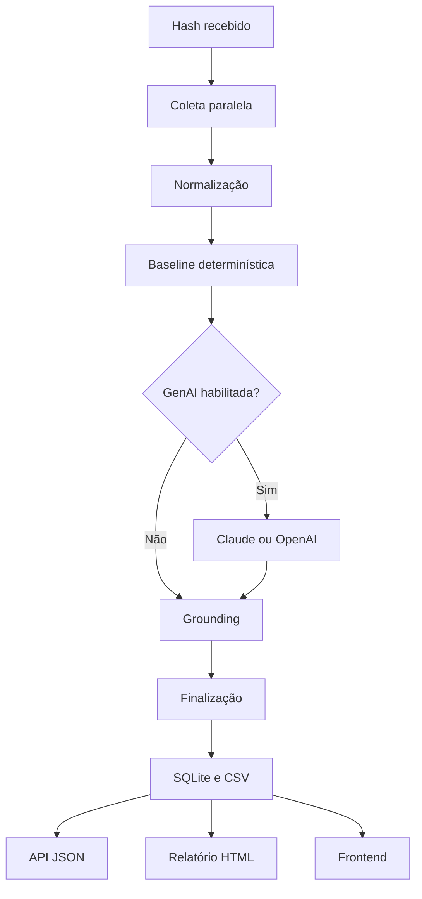

# CTI Triage

API e frontend para triagem de hashes, enriquecimento de Cyber Threat
Intelligence, atribuição assistida de família de malware e geração de relatório
operacional para investigação e threat hunting.

O fluxo consulta VirusTotal e MalwareBazaar, normaliza as evidências, executa
uma análise determinística, usa GenAI opcionalmente e aplica grounding antes de
persistir e disseminar o resultado.

## Funcionalidades

- Validação de MD5, SHA-1 e SHA-256.
- Consulta assíncrona a VirusTotal e MalwareBazaar.
- Normalização de observáveis e evidências rastreáveis.
- Classificação determinística de veredito e confiança.
- Hipóteses de família baseadas em sinais independentes.
- Mapeamento de TTPs para MITRE ATT&CK somente com evidência comportamental.
- Análise opcional com Anthropic Claude ou OpenAI.
- LangGraph para orquestração do workflow.
- Grounding contra evidências inexistentes e IOCs inventados.
- Fallback determinístico quando a GenAI falha.
- Registro do provedor, modelo e consumo de tokens.
- Persistência em SQLite e histórico resumido em CSV.
- Relatório CTI em JSON e HTML imprimível.
- PIRs, investigação de C2, hunting e recomendações MITRE D3FEND.
- Busca de observáveis no histórico.
- Dashboard web sem framework frontend externo.
- Swagger, ReDoc, Docker e testes automatizados.

## Arquitetura



O relatório não faz uma segunda chamada ao modelo. Ele é construído
deterministicamente a partir do `TriageResult` já persistido.

## Estrutura principal

```text
cti-triage/
├── app/
│   ├── api/routes.py
│   ├── clients/
│   │   ├── malwarebazaar.py
│   │   └── virustotal.py
│   ├── services/
│   │   ├── agent.py
│   │   ├── collector.py
│   │   ├── deterministic.py
│   │   ├── normalize.py
│   │   ├── report.py
│   │   └── storage.py
│   ├── static/
│   │   ├── app.css
│   │   ├── app.js
│   │   └── report.css
│   ├── templates/
│   │   ├── index.html
│   │   └── report.html
│   ├── config.py
│   ├── main.py
│   └── models.py
├── docs/
├── tests/
├── .env.example
├── Dockerfile
├── docker-compose.yml
├── requirements.txt
└── requirements-dev.txt
```

## 1. Pré-requisitos

- Python 3.11 ou superior.
- PowerShell.
- Chave do VirusTotal.
- Chave do MalwareBazaar, se exigida pela conta utilizada.
- Chave Anthropic ou OpenAI apenas para a análise GenAI.
- Docker Desktop apenas para execução em container.

## 2. Preparação no Windows

Abra o PowerShell na pasta do projeto:

```powershell
cd "C:\Users\gusta\OneDrive\Área de Trabalho\case_cti\cti-triage"
```

Crie e ative o ambiente virtual:

```powershell
py -3.13 -m venv .venv
.\.venv\Scripts\Activate.ps1
```

Caso a política do PowerShell bloqueie a ativação:

```powershell
Set-ExecutionPolicy -Scope Process -ExecutionPolicy Bypass
.\.venv\Scripts\Activate.ps1
```

Instale as dependências da aplicação e dos testes:

```powershell
python -m pip install --upgrade pip
python -m pip install -r requirements-dev.txt
```

## 3. Configuração

Crie o `.env` a partir do exemplo:

```powershell
Copy-Item .env.example .env
```

Edite somente o `.env`. Nunca coloque chaves reais em `.env.example`.

Exemplo para Claude:

```dotenv
APP_NAME=CTI Triage
APP_ENV=development
DATABASE_PATH=data/cti.db
CSV_EXPORT_PATH=data/triage_history.csv

VIRUSTOTAL_API_KEY=sua_chave
MALWAREBAZAAR_AUTH_KEY=sua_chave_se_aplicavel

ENABLE_GENAI=true
GENAI_PROVIDER=anthropic
ANTHROPIC_API_KEY=sua_chave
ANTHROPIC_MODEL=claude-sonnet-4-6
ANTHROPIC_MAX_TOKENS=4096
```

Para executar sem gastar tokens:

```dotenv
ENABLE_GENAI=false
```

Também é possível manter a aplicação habilitada e enviar no request:

```json
{
  "use_genai": false
}
```

## 4. Testes

Execute toda a suíte:

```powershell
python -m pytest -q
```

Resultado validado nesta versão:

```text
46 passed
```

Testes isolados:

```powershell
python -m pytest -q .\tests\test_models.py
python -m pytest -q .\tests\test_agent.py
python -m pytest -q .\tests\test_report.py
python -m pytest -q .\tests\test_api.py
```

Os testes do agente usam mocks e não consomem tokens do Claude ou OpenAI.

## 5. Execução local

```powershell
python -m uvicorn app.main:app --reload --host 127.0.0.1 --port 8000
```

Acesse:

- Frontend: <http://127.0.0.1:8000/>
- Swagger: <http://127.0.0.1:8000/docs>
- ReDoc: <http://127.0.0.1:8000/redoc>
- Health: <http://127.0.0.1:8000/api/v1/health>

## 6. Primeira triagem

No Swagger, abra `POST /api/v1/triage` e utilize:

```json
{
  "hash": "7a8fc48ce4df4448b91a1e6b66410cca6993ac072cb12860b9cfa6438b25ed8e",
  "providers": [
    "virustotal",
    "malwarebazaar"
  ],
  "use_genai": true,
  "force_refresh": false
}
```

Sinais de que a GenAI foi executada:

```json
{
  "analysis_execution": {
    "requested": true,
    "attempted": true,
    "succeeded": true,
    "engine": "genai",
    "provider": "anthropic",
    "model": "claude-sonnet-4-6",
    "fallback_used": false,
    "error_code": null,
    "usage": {
      "input_tokens": 3250,
      "output_tokens": 980,
      "total_tokens": 4230
    }
  },
  "source_errors": []
}
```

Os números acima são apenas ilustrativos. O consumo real depende da quantidade
de evidências enviada ao modelo.

## 7. Endpoints

| Método | Endpoint | Finalidade |
|---|---|---|
| `GET` | `/api/v1/health` | Verifica disponibilidade |
| `POST` | `/api/v1/triage` | Executa nova triagem |
| `GET` | `/api/v1/scans` | Lista histórico |
| `GET` | `/api/v1/scans/{scan_id}` | Recupera uma triagem |
| `GET` | `/api/v1/scans/{scan_id}/report` | Relatório CTI em JSON |
| `GET` | `/api/v1/scans/{scan_id}/report/html` | Relatório CTI em HTML |
| `GET` | `/api/v1/scans/{scan_id}/export.csv` | Exportação técnica em CSV |
| `GET` | `/api/v1/observables/search` | Busca observáveis no histórico |
| `GET` | `/api/v1/stats` | Métricas do repositório |

Exemplo de busca:

```http
GET /api/v1/observables/search?value=example.com&type=domain&exact=true
```

## 8. Metodologia de inteligência

O relatório aplica:

1. **Direction:** definição de PIRs a partir do hash inicial.
2. **Collection:** consulta independente a fontes públicas de inteligência.
3. **Processing:** normalização em observáveis e evidências identificadas.
4. **Analysis:** baseline determinística e GenAI opcional.
5. **Grounding:** remoção de alegações sem evidência válida.
6. **Dissemination:** resposta JSON, histórico, CSV e relatório HTML.
7. **Feedback:** lacunas e caveats orientam novas coletas.

Os PIRs respondem:

- O artefato deve ser tratado como malicioso ou suspeito?
- Qual família é sustentada pelas evidências?
- Quais comportamentos e TTPs foram observados?
- Existe infraestrutura de rede ou C2 associada?
- Quais ações defensivas devem ser priorizadas?

O relatório diferencia:

- Infraestrutura relacionada.
- Atividade de rede observada.
- Candidato a C2.
- C2 confirmado.

O sistema não promove automaticamente um IOC a C2 confirmado.

## 9. Persistência

Por padrão:

```text
data/cti.db
data/triage_history.csv
```

O SQLite armazena o `TriageResult` completo em JSON e mantém campos indexáveis.
O CSV armazena um resumo para auditoria e análise rápida.

Não apague o arquivo SQLite enquanto a API estiver executando. Faça backup dos
arquivos de `data/` antes de mudanças de schema ou atualização de ambiente.

## 10. Docker

Crie o `.env` antes de iniciar:

```powershell
Copy-Item .env.example .env
```

Construa e execute:

```powershell
docker compose up --build -d
```

Valide:

```powershell
docker compose ps
docker compose logs -f cti-triage
```

Encerre:

```powershell
docker compose down
```

O volume `cti_data` preserva SQLite e CSV entre reinicializações.

Para remover também os dados persistidos:

```powershell
docker compose down -v
```

Esse último comando remove o volume e deve ser usado somente quando a perda do
histórico for intencional.

## 11. Controles de segurança implementados

- Validação estrita do formato de hash.
- Tipagem Pydantic das entradas e saídas.
- Timeout dos provedores externos.
- Prompt que trata metadados externos como conteúdo não confiável.
- Structured output para a GenAI.
- Grounding de famílias, TTPs e C2.
- Fallback determinístico.
- Escape automático no relatório HTML.
- Uso de `textContent` no frontend contra DOM XSS.
- Content Security Policy nas páginas locais.
- Neutralização de Formula Injection em CSV.
- `.env` excluído do Git e do contexto Docker.
- Container executado como usuário sem privilégio.
- Volume dedicado para persistência.

## 12. Troubleshooting

### `422 Unprocessable Content`

Verifique se o JSON possui vírgulas, aspas e hash hexadecimal com 32, 40 ou 64
caracteres.

### Swagger mostra `Failed to fetch`

Confirme se o Uvicorn está ativo:

```powershell
python -m uvicorn app.main:app --reload
```

Depois atualize <http://127.0.0.1:8000/docs>.

### `OpenAIRateLimitError` ou erro de crédito

Consulte `analysis_execution.error_code` e `source_errors`. O workflow preserva
o resultado determinístico mesmo quando o provedor GenAI falha.

### `source_errors` contém falha da GenAI

Confirme:

- `ENABLE_GENAI=true`.
- `GENAI_PROVIDER=anthropic` ou `openai`.
- Chave correspondente configurada.
- Créditos e limites da conta.
- Nome do modelo disponível para a conta.

### Histórico vazio

Execute ao menos uma triagem com sucesso e confirme os caminhos
`DATABASE_PATH` e `CSV_EXPORT_PATH`.

## 13. Limitações conhecidas

- O projeto consulta inteligência existente; não envia amostras para sandbox.
- Atribuição de família não equivale à atribuição de ator ou campanha.
- Ausência de detecção não comprova benignidade.
- Infraestruturas podem ser compartilhadas ou reatribuídas.
- As recomendações devem ser adaptadas ao ambiente da organização.
- O cache por hash ainda pode ser evoluído usando `force_refresh` e TTL.
- Autenticação e autorização devem ser adicionadas antes de exposição pública.

## 14. Critérios de aceite

- [ ] `python -m pytest -q` retorna todos os testes aprovados.
- [ ] Health retorna HTTP 200.
- [ ] Frontend carrega sem erro.
- [ ] VirusTotal e MalwareBazaar aparecem no request.
- [ ] Triagem determinística funciona sem GenAI.
- [ ] Mock de GenAI registra tokens sem custo externo.
- [ ] Execução real controlada identifica provedor, modelo e tokens.
- [ ] SQLite e CSV são criados.
- [ ] Histórico retorna o scan persistido.
- [ ] Relatório JSON retorna cinco PIRs.
- [ ] Relatório HTML é exibido e pode ser impresso em PDF.
- [ ] Busca de observáveis retorna ocorrências do histórico.
- [ ] Docker fica saudável.
- [ ] Nenhuma chave de API está versionada.

## Uso responsável

Este projeto deve ser utilizado para defesa, investigação autorizada e
aprendizado. Não execute amostras maliciosas em máquinas de uso pessoal ou fora
de ambientes isolados e autorizados.
