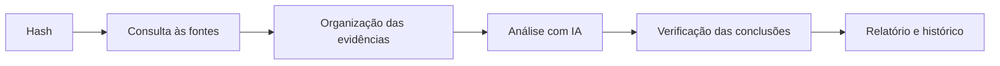

# Challenge Mercado Livre — Threat Intelligence

**CTI Triage** é uma plataforma de triagem de malware. Basta informar o hash de
um arquivo suspeito para que ela:
- consulte o VirusTotal e o MalwareBazaar;
- analise os dados com inteligência artificial;
- indique a provável família do malware;
- gere um relatório de inteligência pronto para as equipes de segurança.

**Hash analisado no case:**
`7a8fc48ce4df4448b91a1e6b66410cca6993ac072cb12860b9cfa6438b25ed8e`

---

## O que foi entregue

| Item do desafio | Entrega |
|---|---|
| 1. Consultar o hash no VirusTotal e no MalwareBazaar | Consulta automática às duas fontes, incluindo comportamento em sandbox, conexões de rede e arquivos relacionados |
| 2. Relatório de inteligência com TTPs, C2 e mitigações | Relatório gerado para cada análise, com MITRE ATT&CK, avaliação de C2, indicadores (IOCs), orientações de investigação, **regras de detecção geradas a partir dos IOCs e do comportamento** e recomendações MITRE D3FEND. Disponível em HTML e PDF |
| 3. API em Python com GenAI (LangGraph/LangChain) e armazenamento | API em Python que usa o Claude (Anthropic) para a triagem e a atribuição de família. Os resultados ficam em SQLite e CSV |
| 4. Extras | Execução em Docker, painel web, histórico de análises, consulta de reputação de IPs e domínios e regras de detecção prontas (YARA e Sigma) |

---

## Resultado da análise do hash

| Pergunta | Resposta |
|---|---|
| **O arquivo é malicioso?** | **Sim**, com confiança alta. 33 antivírus o detectam e ele instala persistência no sistema. |
| **Que tipo de ameaça é?** | Um **infostealer para macOS**, malware que rouba credenciais e dados. As fontes o associam às famílias Phebot, MacSync e AMOS (Atomic macOS Stealer). |
| **O que ele faz?** | Fecha o Terminal para esconder a ação e grava um script oculto. Depois cria uma tarefa (LaunchAgent) para voltar a executar sempre que o usuário faz login. |
| **Há servidor de comando e controle (C2)?** | **Não foi confirmado.** Quase todo o tráfego observado era de serviços legítimos (Apple, Akamai, Fastly). |
| **O que fazer?** | Procurar os indicadores abaixo nos Macs da empresa, isolar as máquinas afetadas e trocar as senhas dos usuários envolvidos. |

**Técnicas MITRE ATT&CK observadas:** T1543.001 (persistência via Launch Agent) e
T1059.004 (execução de comandos via shell).

**Indicadores para busca (IOCs):**

| Indicador | O que é |
|---|---|
| `7a8fc48ce4df4448b91a1e6b66410cca6993ac072cb12860b9cfa6438b25ed8e` | Arquivo analisado (`apps.bin`) |
| `e6e72f978548b80f2e72e9dcf1d7f8c4b7b05a5e045c876651b91405714415c1` | Script oculto gravado pelo malware |
| `b34241006b130412756e834250f2f73da11f895183040618e030b50b5951da9a` | Script que baixou o malware (AMOS) |
| `~/Library/LaunchAgents/com.<usuário>.<16 letras>.plist` | Arquivo de persistência criado no Mac |

> **Controle de qualidade:** o VirusTotal também tentou abrir esse arquivo de Mac num
> ambiente Windows, gerando comportamentos que não pertencem à ameaça. A plataforma
> identifica e descarta esse ruído automaticamente. Sem esse filtro, o relatório
> atribuiria à amostra cinco técnicas que ela não usa.

---

## Como funciona



1. **Coleta:** busca o hash no VirusTotal e no MalwareBazaar.
2. **Organização:** cada informação recebida vira uma evidência identificada.
3. **Análise:** uma análise por regras roda sempre; a IA (Claude) complementa com contexto e interpretação.
4. **Verificação:** tudo o que a IA afirma é conferido com as evidências. Conclusões sem base são descartadas, e infraestrutura legítima nunca é apontada como C2.
5. **Entrega:** o resultado fica salvo e disponível no painel, na API e nos relatórios.

A metodologia segue o **ciclo de inteligência**: requisitos, coleta, processamento,
análise e disseminação. Ele se organiza em cinco perguntas-chave (as da tabela
acima), e o nível de confiança de cada conclusão é declarado.

---

## Relatório

Cada análise gera um relatório de inteligência que pode ser visualizado no
navegador ou **baixado em PDF**. O PDF tem:
- **Capa executiva:** veredito, resumo, principais conclusões e ações prioritárias.
- **Parte técnica:** técnicas ATT&CK, infraestrutura, indicadores, orientações de investigação e recomendações D3FEND.
- **Regras de detecção prontas para uso:** geradas para cada análise, cada uma com a hipótese do que um alerta significa.
  - **A partir dos IOCs:** YARA com os hashes da amostra e da cadeia, e consulta de busca para o Elastic Security.
  - **A partir do comportamento observado:** Sigma e EQL, por exemplo para a persistência via LaunchAgent.
- **Marcação TLP** em todas as páginas.
- **Indicadores de rede neutralizados** (ex.: `exemplo[.]com`), para evitar cliques acidentais.

---

## Como executar

**Requisitos:** Docker Desktop e chaves de API do VirusTotal, do MalwareBazaar e da
Anthropic. A chave da Anthropic é opcional; sem ela, a análise roda sem IA.

1. Copie o arquivo `.env.example` para `.env` e preencha as chaves.
2. Na pasta do projeto, execute:

   ```powershell
   docker compose up -d --build
   ```

3. Acesse o painel em **<http://localhost:8000>**, cole o hash e clique em **Executar triagem**.

A documentação interativa da API fica em <http://localhost:8000/docs>.

---

## Regras de detecção

Além das regras geradas em cada relatório, a pasta [`detections/`](detections/README.md)
traz material revisado manualmente para este hash:
- **Regras YARA** para identificar o arquivo e os artefatos de persistência.
- **Regras Sigma**, conversíveis para o Elastic Security.
- **Script de verificação para macOS**, que procura sinais da infecção sem alterar nada na máquina.

---

## Limitações

- A plataforma usa análises de fontes públicas; não executa o malware em ambiente próprio.
- A família indicada é uma hipótese baseada nas fontes, não uma atribuição definitiva.
- Antes de uso fora de ambiente controlado, é preciso adicionar autenticação.

---

*Projeto destinado a defesa e investigação autorizada.*
